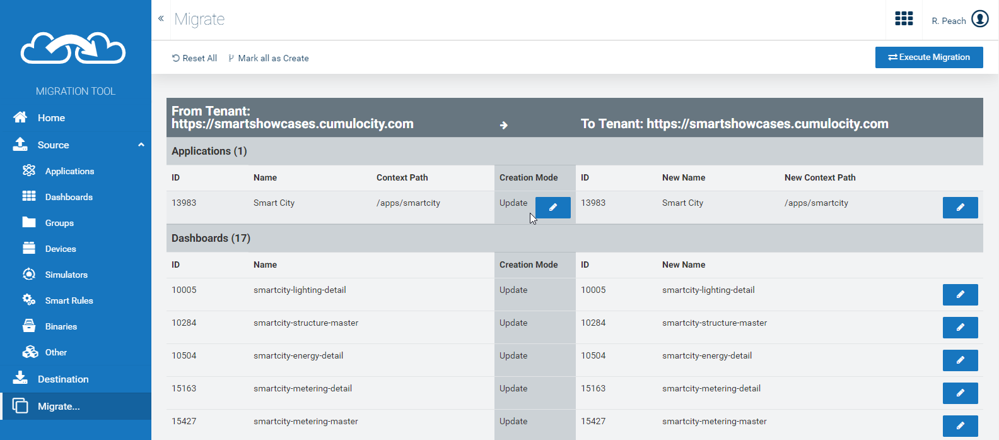

# Cumulocity Migration Tool
A Cumulocity webapp to migrate applications, dashboards, groups, devices, simulators, smart rules, images and managed objects between tenants.

# Installation
The migration tool can be installed in 2 ways:
1. [Migrated from another tenant](#installing-from-another-tenant)
2. [Installed from a release](#installing-from-a-release)

## Installing from another tenant
1. Find a tenant with the migration tool already installed
2. Open the migration tool and navigate to **Destination**
3. Select **Other Tenant**
4. Enter the connection details
5. Click **Check connection** - You may need to follow the instructions to fix CORS (Cross Origin Resource Sharing) errors
6. Click the **Deploy to Tenant** button

## Installing from a release
1. Grab the **[Latest Release Zip](https://github.com/SoftwareAG/cumulocity-migration-tool/releases)**
2. Go to the **Administration view** in your tenant (/apps/administration)
3. Open the **Own applications** section in the navigator
4. Click **Add application**
5. Select **Upload web application**
6. Select the Zip you downloaded earlier

# Quickstart
1. Open the migration tool on the tenant you want to migrate to (The destination tenant)
2. Click the Source folder in the navigator
3. Select Other Tenant, and enter the login details
4. Select any objects you want to migrate
5. Click the Destination folder in the navigator
6. Select Current Tenant, and enter the login details
7. Click Migrate... in the navigator
8. Make any edits to the objects
9. Click Execute Migration in the action bar

# [FAQ - Frequently Asked Questions](https://github.com/SoftwareAG/cumulocity-migration-tool/wiki/Frequently-Asked-Questions)
The [FAQ](https://github.com/SoftwareAG/cumulocity-migration-tool/wiki/Frequently-Asked-Questions) contains information, limitations, and extra troubleshooting instructions.

# Screen Overview

1. Connection Type
   - Current Tenant - The tenant that the migration tool is currently running on
   - Other Tenant - A remote tenant
   - File - A migration tool export zip file
2. Tenant URL - The url of the tenant (must start with https://)
3. Username - The user to connect to the tenant with
   - Must have Reader and Global Reader access for the Source Tenant
   - Must have Administrator access for the Destination Tenant
4. User's password
5. Check connection - Checks that the migration tool can access the tenant
   

1. From/To details
2. Creation Mode - Switch between creating and updating an existing object
3. Edit the object
4. Mark all as Create - Changes the creation mode of every item to Create
5. Reset All - Resets any changes made
6. Execute Migration - Starts the migration

------------------------------

These tools are provided as-is and without warranty or support. They do not constitute part of the Software AG product suite. Users are free to use, fork and modify them, subject to the license agreement. While Software AG welcomes contributions, we cannot guarantee to include every contribution in the master project.
_____________________
For more information you can Ask a Question in the [TECHcommunity Forums](https://tech.forums.softwareag.com/tags/c/forum/1/Cumulocity-IoT).

You can find additional information in the [Software AG TECHcommunity](https://tech.forums.softwareag.com/tag/Cumulocity-IoT).
